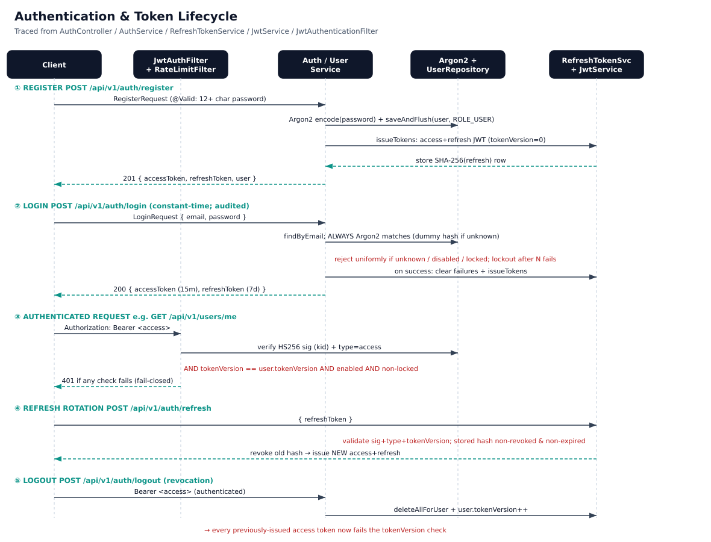
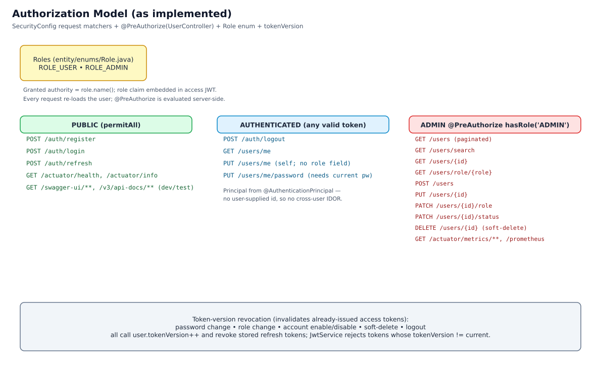
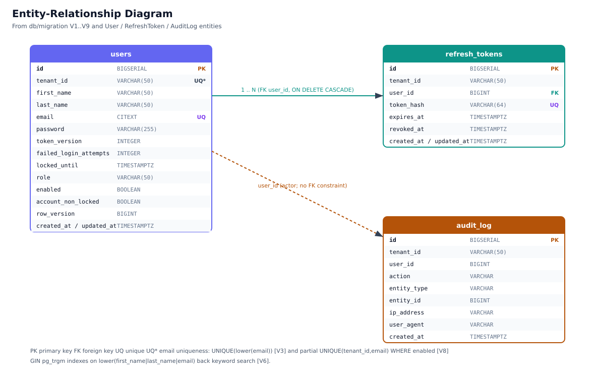

# User Management & Authentication Service

A production-grade Spring Boot 3 authentication service for multi-tenant systems. Implements JWT auth with token rotation, Argon2 hashing, role-based access control (RBAC), per-IP rate limiting, and audit logging. **92% test coverage** with Testcontainers-backed integration tests.

> Every claim is backed by code reference and measurable tests. See [Testing](#testing).

## Contents
- [Architecture Diagrams](#architecture-diagrams)
- [Features (with source references)](#features-with-source-references)
- [Technical Stack](#technical-stack)
- [Getting Started](#getting-started)
- [Testing](#testing)
- [API Reference](#api-reference)
- [Configuration](#configuration-production)
- [Security Boundaries](#security-boundaries)
- [Known Limitations](#known-limitations)

## Architecture Diagrams

Diagrams are generated from the real code by [`docs/generate_diagrams.py`](docs/generate_diagrams.py)
(run `python3 docs/generate_diagrams.py` to regenerate).

### Authentication & token lifecycle


### Authorization model


### Entity-relationship diagram


## Features (with source references)

### Authentication
- JWT access tokens (HS256) and refresh tokens issued by
  [`JwtService`](src/main/java/com/company/usermanagement/security/JwtService.java);
  access-token TTL defaults to **15 min** (`JWT_EXPIRATION_MS=900000`, prod/base) and refresh
  to **7 days** (`JWT_REFRESH_MS=604800000`). Note: the **`dev` profile overrides the access
  TTL to 24 h** (`application-dev.yml`).
- Refresh tokens are stored only as **SHA-256 hashes** and **rotated** on `/auth/refresh`
  (old hash revoked, new pair issued) —
  [`RefreshTokenService`](src/main/java/com/company/usermanagement/service/RefreshTokenService.java).
- Signing-key ring with `kid` header supports **key rotation** (current + previous secret) —
  `JwtService.JwtKeyRing`.
- **Constant-time login**: `AuthService.login` always runs one Argon2 verification (against a
  dummy hash when the account does not exist) so response latency does not reveal whether an
  email is registered —
  [`AuthService`](src/main/java/com/company/usermanagement/service/AuthService.java).
- Stateless (`SessionCreationPolicy.STATELESS`) —
  [`SecurityConfig`](src/main/java/com/company/usermanagement/config/SecurityConfig.java).

### Token revocation
`user.token_version` is incremented — and stored refresh tokens revoked/deleted — on
**password change, role change, account enable/disable, soft-delete, and logout**
(`UserService`, `AuthService`). `JwtService.isAccessTokenValid` rejects any access token whose
`tokenVersion` claim differs from the current DB value, so already-issued access tokens stop
working immediately (bounded otherwise by the 15-min TTL).

### Authorization
- Password hashing via **Argon2** (`Argon2PasswordEncoder.defaultsForSpringSecurity_v5_8()`,
  `SecurityConfig`).
- Admin operations gated by `@PreAuthorize("hasRole('ADMIN')")` on
  [`UserController`](src/main/java/com/company/usermanagement/controller/UserController.java);
  `@EnableMethodSecurity` in `SecurityConfig`.
- Self-service endpoints resolve the caller via `@AuthenticationPrincipal` (no client-supplied
  id), so a `ROLE_USER` cannot read or mutate another user's record. Enforcement is proven by
  `UserControllerIntegrationTest` (including explicit privilege-escalation negative-path tests).

### Password policy
`@ValidPassword` — 12+ chars with at least one uppercase, one digit, and one special char from
`@$!%*?&_#`
([`PasswordValidator`](src/main/java/com/company/usermanagement/validation/PasswordValidator.java)).

### Hardening
- Rate limiting via **Bucket4j** with a **Redis** backend and local **Caffeine** fallback;
  a single key per request (client IP for `/auth/*`, `user:<email>` for authenticated calls).
  The filter **fails closed** (HTTP 429) if the limiter errors —
  [`RateLimitFilter`](src/main/java/com/company/usermanagement/security/RateLimitFilter.java),
  [`RateLimitService`](src/main/java/com/company/usermanagement/service/RateLimitService.java).
- **Account lockout** after `AUTH_MAX_FAILED_ATTEMPTS` (default 5) failures for
  `AUTH_LOCK_DURATION_MINUTES` (default 15) — `User.registerFailedLoginAttempt`.
- **Audit logging** of security events with actor, IP and user agent —
  [`AuditService`](src/main/java/com/company/usermanagement/service/AuditService.java)
  (see the caveat in [Known Limitations](#known-limitations)).
- Security response headers set by
  [`SecurityHeadersConfig`](src/main/java/com/company/usermanagement/config/SecurityHeadersConfig.java)
  and `SecurityConfig`: `Strict-Transport-Security`, `Content-Security-Policy`,
  `X-Frame-Options: DENY`, `X-Content-Type-Options: nosniff`, `Referrer-Policy`,
  `Permissions-Policy`, `X-XSS-Protection: 0` (legacy auditor intentionally disabled),
  and cache-control headers.
- XSS: query params / form fields sanitized by `XssCleanerFilter`; **JSON bodies are not
  sanitized** (rely on validation + output encoding + CSP).
- HTTPS enforcement in prod via `HttpsEnforcementFilter` (honours `X-Forwarded-Proto`).

### Observability
- Actuator `health`/`info` public; `metrics`/`prometheus` require `ROLE_ADMIN` (`ApiPaths`).
- `X-Request-ID` propagation + MDC (`RequestIdFilter`); JSON logging in `prod` via Logstash
  (`logback-spring.xml`).

## Technical Stack

| Layer | Technology |
|-------|------------|
| Runtime | Java 21 (LTS) |
| Framework | Spring Boot 3.2.5, Spring Security 6.2.4 |
| Database | PostgreSQL (Testcontainers use 16), Hibernate, Flyway 10.15.0 |
| Cache / rate limiting | Redis, Caffeine, Bucket4j 8.9.0 |
| JWT | JJWT 0.12.5 |
| Tests | JUnit 5, Mockito, Testcontainers 1.20.6 |
| API docs | OpenAPI 3 / Swagger UI (disabled in prod) |

## Getting Started

### Prerequisites
- JDK 21+
- Docker + Docker Compose (required for integration/repository tests, which use Testcontainers)

### Local setup
```bash
cp .env.example .env
docker-compose up -d                 # PostgreSQL + Redis
./mvnw spring-boot:run -Dspring-boot.run.profiles=dev
```
With the `dev` profile the app listens on **port 8081** (`application-dev.yml`); the base
profile default is 8080. Swagger UI (dev/test): `http://localhost:8081/api/v1/swagger-ui.html`.

## Testing

Integration and repository tests start real PostgreSQL and Redis containers via Testcontainers,
so a working Docker daemon is required.

```bash
./mvnw test                # unit tests only (Testcontainers-backed *IntegrationTest excluded)
./mvnw verify -Pit         # unit + integration tests, JaCoCo report + coverage gate
python3 docs/generate_diagrams.py   # regenerate the architecture diagrams
```

> **Docker Engine 25+ note.** Testcontainers' bundled docker-java negotiates Docker API 1.32,
> which Docker Engine 25+ rejects (min 1.44). The build pins the negotiated version via
> `-Dapi.version=${docker.api.version}` (default `1.44`) in the surefire/failsafe config
> (`pom.xml`). Without it, container-backed tests fail with *"client version 1.32 is too old"*.

**Last measured run** (`./mvnw clean verify -Pit`, 2026-07-08):

| Suite | Tests | Result |
|-------|-------|--------|
| Unit (surefire) | 196 | 0 failures / 0 errors |
| Integration (failsafe) | 28 | 0 failures / 0 errors |
| **Total** | **224** | **BUILD SUCCESS** |

| JaCoCo counter | Coverage |
|----------------|----------|
| Instructions | **91.9 %** |
| Branches | **77.2 %** |
| Lines | **92.4 %** |
| Methods | **93.1 %** |

The build enforces a JaCoCo **80 % line** gate (`jacoco:check`, `pom.xml`); the HTML report is
written to `target/site/jacoco/index.html` by the `verify` phase.

## API Reference

Base path: `/api/v1`.

### Authentication
| Method | Path | Auth | Description |
|--------|------|------|-------------|
| POST | `/auth/register` | Public | Create a `ROLE_USER` account; returns tokens |
| POST | `/auth/login` | Public | Authenticate; returns access + refresh tokens |
| POST | `/auth/refresh` | Public | Rotate refresh token; returns new tokens |
| POST | `/auth/logout` | Authenticated | Revoke refresh tokens, increment token version |

### User management
| Method | Path | Access | Description |
|--------|------|--------|-------------|
| GET | `/users/me` | Authenticated | Current user's profile |
| PUT | `/users/me` | Authenticated | Update own first/last name (and optionally password) |
| PUT | `/users/me/password` | Authenticated | Change password (requires current password) |
| GET | `/users` | Admin | List users (paginated) |
| GET | `/users/search` | Admin | Search by keyword |
| GET | `/users/{id}` | Admin | Get user by id |
| GET | `/users/role/{role}` | Admin | List users by role |
| POST | `/users` | Admin | Create a user with an explicit role |
| PUT | `/users/{id}` | Admin | Update a user |
| PATCH | `/users/{id}/role` | Admin | Change a user's role |
| PATCH | `/users/{id}/status` | Admin | Enable/disable a user |
| DELETE | `/users/{id}` | Admin | Soft-delete (disable) a user |

## Configuration (production)

`application-prod.yml` reads these environment variables (subset; see the file for all):

| Variable | Description | Default | Required |
|----------|-------------|---------|----------|
| `JWT_SECRET` | Base64 signing secret, decodes to ≥ 32 bytes (HS256) | — | Yes |
| `JWT_PREVIOUS_SECRET` / `JWT_KID` / `JWT_PREVIOUS_KID` | Key-rotation secrets/ids | empty / `current` / `previous` | No |
| `JWT_EXPIRATION_MS` / `JWT_REFRESH_MS` | Access / refresh TTL (ms) | `900000` / `604800000` | No |
| `DBNAME` / `DBUSER` / `DBPASSWORD` | PostgreSQL database/user/password | — | Yes |
| `DBHOST` / `DBPORT` | PostgreSQL host/port | `localhost` / `5432` | No |
| `ALLOWED_ORIGINS` | CORS origins (comma-separated) | — | Yes |
| `RATE_LIMIT_BACKEND` | `redis` or `local` | `redis` | No |
| `RATE_LIMIT_AUTH_CAPACITY` / `_REFILL_TOKENS` / `_REFILL_SECONDS` | Auth-endpoint bucket | `10` / `10` / `60` | No |
| `AUTH_MAX_FAILED_ATTEMPTS` / `AUTH_LOCK_DURATION_MINUTES` | Lockout policy | `5` / `15` | No |
| `TRUSTED_PROXY_CIDRS` | Trusted proxies for client-IP resolution | see file | No |

`AppProperties` validates the JWT secret at startup (Base64, ≥ 32 bytes); the app fails fast if
`JWT_SECRET` or `ALLOWED_ORIGINS` is missing in prod. See `.env.example` for a template.

## Security Boundaries

Provided: user registration/login, JWT auth with rotation and token-version revocation, RBAC for
two roles, Argon2 password hashing + complexity, per-IP/per-user rate limiting, account lockout,
and audit logging.

Not provided: OAuth2/OIDC federation, MFA/2FA, social login/SSO, fine-grained permissions beyond
the two roles, and multi-tenant isolation.

## Known Limitations

Honest, current-state list for an auth system:

- **No password-reset / forgot-password flow.** There is no such endpoint anywhere in the code,
  and therefore no email-verification or reset-token rate limiting. Password change requires the
  current password and an authenticated session (`PUT /users/me/password`).
- **No MFA/2FA and no OAuth2/OIDC/SSO.**
- **Account enumeration is only partly mitigated.** Login is constant-time (see Features), but
  `POST /auth/register` returns `409 Conflict` for an already-registered email, which reveals
  existence. There is no email-verification flow that would let registration avoid this.
- **No refresh-token reuse/theft detection.** A rotated (revoked) refresh token is rejected, but
  presenting a stolen-but-not-yet-rotated token is not detected as a breach and does not revoke
  the whole token family.
- **Audit writes are effectively synchronous.** `AuditService.saveAsync` is annotated `@Async`
  but is invoked from within the same bean (`recordWithContext` → `saveAsync`), so Spring's proxy
  is bypassed and it runs on the request thread. Failures are swallowed and logged. It is
  functional but not asynchronous, and there is no cryptographic tamper-evidence on audit rows.
- **Multi-tenancy is a stub.** `TenantIdentifierResolver` always returns `default`; the
  `tenant_id` columns and Hibernate `@TenantId` wiring exist but no tenant is ever resolved from
  the request/JWT.
- **Rate limiting is single-key and per-instance on fallback.** One key per request (IP or user),
  not layered IP+user; when Redis is down each instance limits independently in memory.
- **Schema note:** email uniqueness is enforced globally by `UNIQUE(lower(email))` (V3), which is
  never dropped. The later partial index `UNIQUE(tenant_id, email) WHERE enabled` (V8) and its
  "allow reuse of soft-deleted emails" comment are therefore **not** effective — a soft-deleted
  email cannot currently be re-registered.
- **`dev`-only:** the seeded `admin@company.com` in `db/dev-migration/V900` stores a **BCrypt**
  hash while the app uses `Argon2PasswordEncoder`, so that seeded account cannot log in. This
  affects the `dev` profile only (prod uses `classpath:db/migration` without the seed).
- **Dependency currency:** Spring Boot 3.2.5 / Spring Security 6.2.4 / Tomcat 10.1.20 /
  logback 1.4.14 are from 2024. Run an OWASP dependency-check / upgrade pass before launch.

## License

MIT License

---
**Last updated:** 2026-07-08 · **Java:** 21 LTS · **Spring Boot:** 3.2.5
